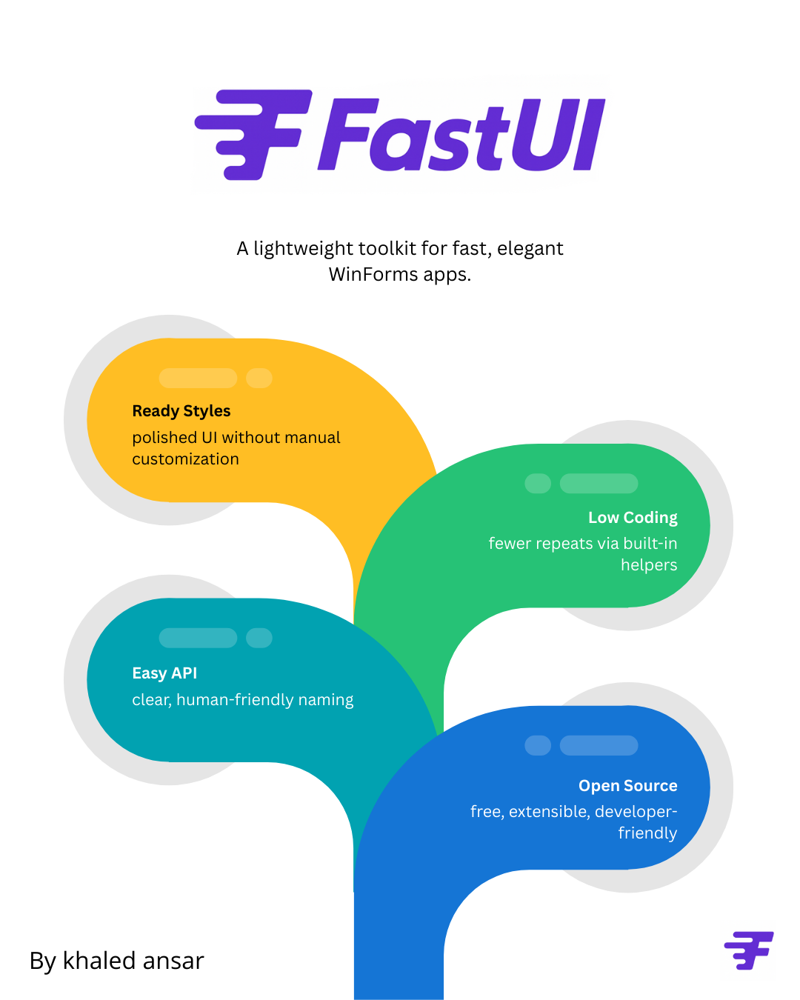

---

# FastUI

FastUI is a lightweight, modern UI toolkit for WinForms — now fully independent with its own rendering engine.

Born out of a backend developer’s need for simple, elegant test interfaces, FastUI brings a fresh, clean experience to the traditionally outdated WinForms environment.

---

## 📖 The Story Behind FastUI

As a .NET backend developer, I often needed quick desktop interfaces to test APIs, logic, or internal tools.  
WinForms was always the fastest choice — but it also felt old, rigid, and visually outdated.

Despite being used only for testing, the UI experience still mattered.  
I noticed three recurring issues:

- The same UI elements are used in almost every desktop tool.
- The same repetitive logic is implemented again and again.
- Styling was tedious, limited, and far from modern.

With my background in .NET, OOP, and software architecture — and with the help of AI — the idea became clear:

### \*\*Don't build another application…

Build a tool that builds applications.\*\*

FastUI now ships with its own rendering engine, designed from scratch to allow full control, reusable components, and modern styles — all while keeping the simplicity of WinForms.

It is open-source, continuously evolving, and shaped to make desktop UI development faster and cleaner.

---

## ✨ Current Components

FastUI is still in active development, but it already includes:

- **FuiButton**
- **FuiTextBox**
- **FuiComboBox**
- **FuiPanel**

More components are planned as the framework grows.

---

## 🎯 Goals

- Provide clean, modern, ready-to-use UI components
- Reduce repetitive WinForms logic through smart helpers
- Enable fast prototyping and real-world application development
- Offer a simple, readable API without complex naming conventions
- Deliver a flexible, extensible, open-source toolkit for developers

---

## ⭐ Core Philosophy

**Ready Styles:** no manual UI tweaking  
**Low Coding:** fewer repetitive tasks  
**Easy API:** simple, human-friendly naming  
**Open Source:** free, extensible, and community-driven

---

## 📌 Status

FastUI is in active development.  
The current version is stable enough for testing tools, internal applications, and small prototypes.  
Many improvements and new components are planned as the rendering engine evolves.

---

## 🤝 Contribute

FastUI is open-source — feel free to clone, extend, contribute, or build your own components on top of it.

More documentation will be added as the project grows.
